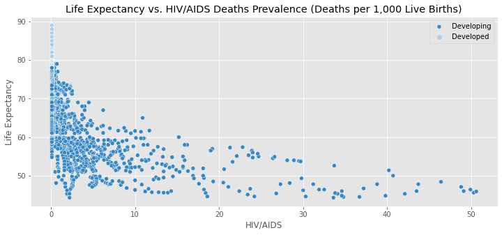
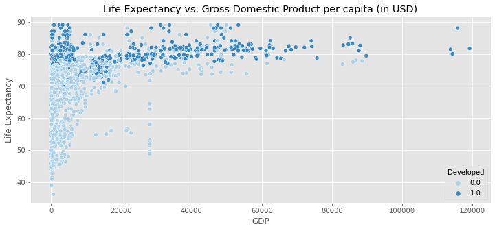
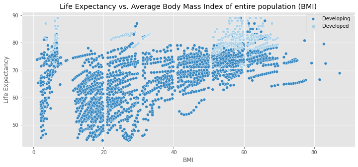
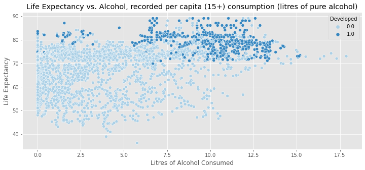
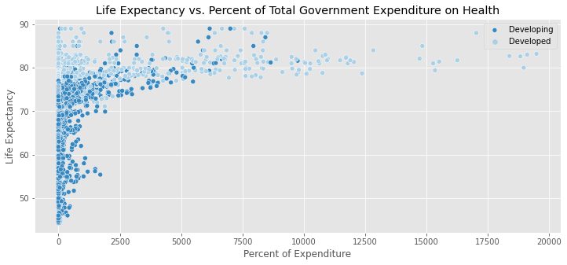
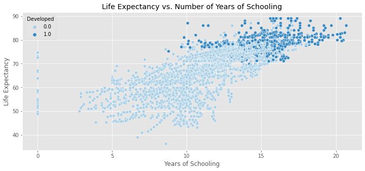

Life Expectancy

The purpose of this project is to create a predictor system for life expectancy in the US based on one's year of birth, race, and gender. Exploratory Data Analysis was performed on multiple datasets to make connections between life expectancy trends and predictions. 

The plan is for this to be completed by utilizing grouped life expectancy time series data as well as individual data 

Quote from Caste: 
* The average white american at age 25 is likely to live 5 years longer than the average African-American. 

Methods: 
LIFE EXPECTANCY PREDICTIVE & INFERENTIAL MODELING: 
* Dataset = Kaggle, Life Expectancy.csv
* Overview: 
    * 2938 entries
    * 193 countries
    * 16 years
* Data Cleaning: 
    * Rename columns for easier reading
    * Drop 'Adult Mortality' as it is a close correlate of life expectancy
    * One-hot encode for Status
    * Fill null values with mean of grouped values 
    * Removing Outliers: 
        *
* EDA: 
    * Life Expectancy Correlation with various other features: 
    * HIV/AIDS Prevalence: 
        * 
    * Gross Domestic Product: 
        * 
    * Body Mass Index: 
        * 
    * Alcohol Consumption: 
        * 
    * Gross Domestic Product: 
        * 
    * Percent of Total Government Expenditure on Health: 
        * 
    * Number of Years of Schooling: 
        * 

References: 
* For EDA, Machine Learning, and Modelling: 
    * Data Science Society, [Using Machine Learning to Explain and Predict the Life Expectancy of Different Countries](https://www.datasciencesociety.net/using-machine-learning-to-explain-and-predict-the-life-expectancy-of-different-countries/), accessed July 2021
    * [Using KNN to impute missing values](https://www.askpython.com/python/examples/impute-missing-data-values), accessed July 2021
    * [A Guide to KNN Imputation](https://medium.com/@kyawsawhtoon/a-guide-to-knn-imputation-95e2dc496e), accessed July 2021

* For Theoretical Understanding of Inequities: 
    * Wilkerson, Isabel. Caste: The Origins of Our Discontents. 

* For Understanding Life Tables and Expectancy Data: 
    * Measure Evaluation, [Lesson 3: Life Tables](https://www.measureevaluation.org/resources/training/online-courses-and-resources/non-certificate-courses-and-mini-tutorials/multiple-decrement-life-tables/lesson-3.html), accessed July 2021

* DataSets: 
    * Kaggle, 
    * [The Health Inequality Project](https://healthinequality.org/data/)  

