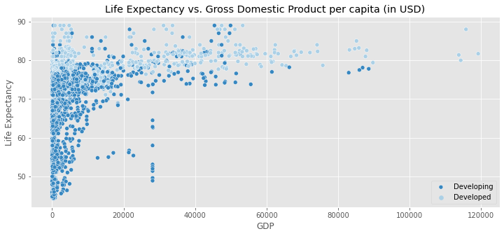
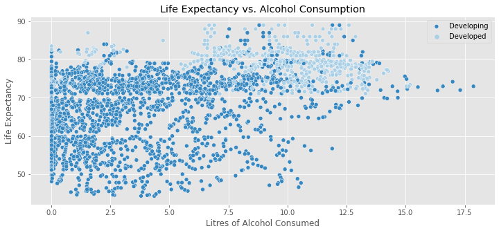
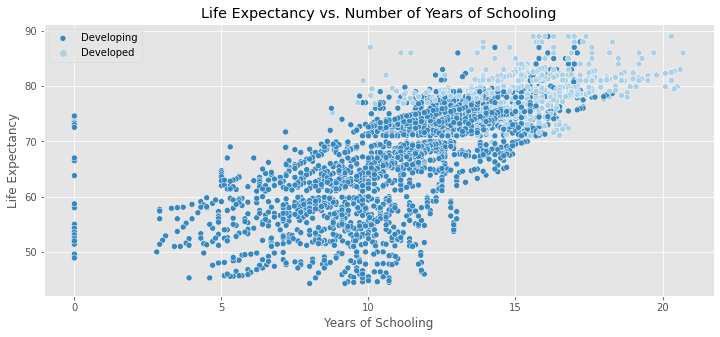

# Life Expectancy Predictions:   Using Regression to Predict Age at Death 
### Becky Peters, Capstone Project #2  
[LinkedIn](https://www.linkedin.com/in/beckyepeters/) | [Email](becky.e.peters@gmail.com) | [Github](github.com/beckyepeters) | 
[Presentation Slides](https://docs.google.com/presentation/d/1kyQm9iWg2_uPWKNxI9JB-whBD1yLizMJlnedRAk4cv8/edit?usp=sharing) 
RPP2 Cohort of Galvanize Data Science Immersive Program  

## Background and Motivation
The purpose of this project is to create a predictor system for life expectancy in the US based on important factors for life expectancy prediction based on an algorithmic regression model. Exploratory Data Analysis was performed on multiple datasets to make connections between life expectancy trends and future predictions. 

The original plan was for this to be completed by utilizing grouped life expectancy time series data as well as individual data for deceased individuals in the United States. Obtaining such data proved more difficult than imagined, as each source of data provided some insights while also neglecting other interesting features. I was hoping to begin to understand inequities in life expectancy for different subpopulations through the model (), but the project was both more limited and more expansive in scope than I anticipated.   

According to [CDC Mortality Data](https://www.cdc.gov/nchs/data-visualization/mortality-trends/index.htm), the life expectancy at birth for US individuals in 2017 was as follows: 
Table 1: 2017 Discrepancies in Life Expectancy across 2 races and 2 genders
| White Females | White Males | Black Females | Black Males |
| --------------| ------------| --------------| ------------|
| 81 years | 76 years | 78 years | 71 years | 

By digging into data from the National Longitudinal Mortality Survey, conducted by the US Census. From [their website](https://www.census.gov/topics/research/nlms.html), the NLMS is "a database developed to better understand the effects of demographic and socio-economic characteristics of differentials in U.S. mortality rates." 

The NLMS has a few public-use datasets available for researchers, the most recent of which tracked survey participants from 2002 through 2008. Initial description of the dataset is as follows: 

Methods: 
LIFE EXPECTANCY PREDICTIVE & INFERENTIAL MODELING: 
* Dataset = Kaggle, Life Expectancy.csv
* Overview: 
    * 2938 entries
    * 193 countries
    * 16 years
* Data Cleaning: 
    * Rename columns for easier reading
    * Drop 'Adult Mortality' as it is a close correlate of life expectancy
    * One-hot encode for Status
    * Fill null values with mean of grouped values 
    * Removing Outliers: 
        *
* EDA: 
    * Life Expectancy Correlation with various other features: 
    * HIV/AIDS Prevalence: 
        * 
    * Gross Domestic Product: 
        * 
    * Body Mass Index: 
        * 
    * Alcohol Consumption: 
        * 
    * Gross Domestic Product: 
        * 
    * Percent of Total Government Expenditure on Health: 
        * 
    * Number of Years of Schooling: 
        * 

References: 
* For EDA, Machine Learning, and Modelling: 
    * Data Science Society, [Using Machine Learning to Explain and Predict the Life Expectancy of Different Countries](https://www.datasciencesociety.net/using-machine-learning-to-explain-and-predict-the-life-expectancy-of-different-countries/), accessed July 2021
    * [Using KNN to impute missing values](https://www.askpython.com/python/examples/impute-missing-data-values), accessed July 2021
    * [A Guide to KNN Imputation](https://medium.com/@kyawsawhtoon/a-guide-to-knn-imputation-95e2dc496e), accessed July 2021
    * [Hyperparameter Tuning the Random Forest in Python Using SciKitLearn](https://towardsdatascience.com/hyperparameter-tuning-the-random-forest-in-python-using-scikit-learn-28d2aa77dd74)

* For Theoretical Understanding of Inequities: 
    * Wilkerson, Isabel. Caste: The Origins of Our Discontents. 

* For Understanding Life Tables and Expectancy Data: 
    * Measure Evaluation, [Lesson 3: Life Tables](https://www.measureevaluation.org/resources/training/online-courses-and-resources/non-certificate-courses-and-mini-tutorials/multiple-decrement-life-tables/lesson-3.html), accessed July 2021

* DataSets: 
    * Kaggle, 
    * [The Health Inequality Project](https://healthinequality.org/data/)  

