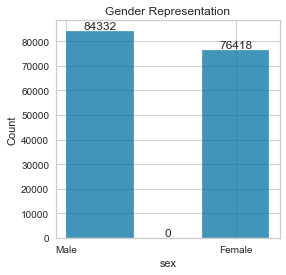

# Life Expectancy Predictions: <br> Using Regression to Predict Age at Death 
### Becky Peters, Capstone Project #2 <br>
[LinkedIn](https://www.linkedin.com/in/beckyepeters/) | [Email](becky.e.peters@gmail.com) | [Github](github.com/beckyepeters) | 
[Presentation Slides](https://docs.google.com/presentation/d/1kyQm9iWg2_uPWKNxI9JB-whBD1yLizMJlnedRAk4cv8/edit?usp=sharing)<br>
RPP2 Cohort of Galvanize Data Science Immersive Program <br>

## Background and Motivation
The purpose of this project was to create a deployable predictor app for life expectancy in the US based on CDC Multiple Mortality Causes data using the best-performing regression algorithm. Model evaluation did not meet or exceed my own expectations for deployment so the app remains in local development, with only ___ accuracy and rmse of ... 

Exploratory Data Analysis was performed on multiple datasets to make connections between life expectancy trends and future predictions. There are a number of ways to download CDC publicly-available datasets, and it took me some time to figure out the right combination of dropdown fields on their site for appropriate data (a statement which, at time of writing, is meant as a compliment to their system and the multiple ways data can be accessed.) 

The original plan was for this goal to be met by utilizing grouped life expectancy time series data as well as individual data for deceased individuals in the United States. I was hoping to begin to understand inequities in life expectancy for different subpopulations through the model, but the project was both more limited and more expansive in scope than I'd anticipated. I did, however, discover some interesting insights, and learn a lot about a few different tools which I'll expand upon below. 

According to [CDC Mortality Data](https://www.cdc.gov/nchs/data-visualization/mortality-trends/index.htm), the life expectancy at birth for US individuals in 2017 was as follows: <br>
<br>
Table 1: 2017 Discrepancies in Life Expectancy across 2 races and 2 genders
| White Females | White Males | Black Females | Black Males |
| --------------| ------------| --------------| ------------|
| 81 years | 76 years | 78 years | 71 years | 

To investigate the potential for prediction on such numbers given a set of anonymized ages at death with features such as race, gender assigned at birth, state of residence, and more, I found data from the National Longitudinal Mortality Survey (NLMS) particularly helpful. The NLMS, conducted by the US Census is (from [their website](https://www.census.gov/topics/research/nlms.html) "a database developed to better understand the effects of demographic and socio-economic characteristics of differentials in U.S. mortality rates." Sounds close to my inquiry! 

The NLMS has a few different public-use datasets available for researchers, the most recent of which tracked survey participants from 2002 through 2008. Pre-cleaning description of the dataset is as follows:

## Data and EDA
* Data can be requested at this site: [https://biolincc.nhlbi.nih.gov/studies/nlms/](https://biolincc.nhlbi.nih.gov/studies/nlms/)
* Overview: 
    * 1,835,072 entries
    * 42 columns (age, race, sex, marital status, day of death, etc.)
* Data Cleaning: 
    * Only retain information for deceased individuals (reduced to 160,750 entries)
    * Dropped columns to do with smoking status (too many NaNs; accepted that model would only perform for non-smokers; list = ['smok100', 'agesmk', 'smokstat', 'smokhome', 'curruse', 'everuse'])
    * Collapsed cause of death column to 11 major categories given by CDC 
    * Dropped other irrelevant columns or columns with too much missing information(e.g. Household ID number, Occupation, Citizen status, etc.) 
    * Features remaining for prediction = Age, Race, Gender, Marital Status, Hispanic ethnicity, Adjusted Income, Education Level, Health Insurance Type, Place of Birth, Urban / Rural Residence 
* EDA: 
    * Representation of Race in Dataset: 
        * 
    * Representation of Gender in Dataset: 
        * 
    * Representation of Different Types of Health Insurance: 
        * 
    * Representation of Urban v. Rural Residence: 
        * 

## Modeling and Predictions
* Pipeline after X, y split: 
    * Used [kNN Imputation](http://scikit-learn.org/stable/modules/generated/sklearn.impute.KNNImputer.html) (```from sklearn.impute import KNNImputer```) to fill in missing values for remaining features
    * Used [One-Hot Encoding](http://scikit-learn.org/stable/modules/generated/sklearn.preprocessing.OneHotEncoder.html) (```from sklearn.preprocessing import OneHotEncoder```) to encode categorical variables 
* Experimenting with Algorithms: 
    * Linear Regression: 
        * 
        * Included exploration of different regularizations as well (Lasso, Ridge, ElasticNet)  
    * Random Forest Regressor: 
        * 
        * Random Forest had the best inital MSE and R-squared metrics; hypertuned for better results. Mean squared error bottomed out at 12.9. 
* Flask App for Prediction (Local Development; screenshots below): 
    * 
    * Upon utilizing the dropdowns to enter personal information, a user would then see a prediction on a new page: 
        * 

## Conclusions and Limitations: 
* Though I was able to optimize the model for a lower Mean Squared Error, the results of the predictions were, on the whole, much lower than expected, and affected differently than expected when dropdowns were changed (for example, a white male with no insurance and other inputs gives a prediction of 49 years old at death, and changing the income does not make a difference in the prediction). I believe the discrepancies come from a few factors, most notably the discrepancy in insurance representation (most deaths occured for individuals on medicaid) and the discrepancy in race representation in the dataset. For future tuning, I will explore upsampling and downsampling for different populations. 
* Overall I learned a great deal about the implementation of a Random Forest regressor in making predictions, finessing the data inquiry from CDC to provide the right information, and the importance of discussing feature selection with colleagues as an important part of the process. I learned about front-end development and web applications using Flask and jQuery. 

## References: 
* For EDA, Machine Learning, and Modelling: 
    * Data Science Society, [Using Machine Learning to Explain and Predict the Life Expectancy of Different Countries](https://www.datasciencesociety.net/using-machine-learning-to-explain-and-predict-the-life-expectancy-of-different-countries/), accessed July 2021
    * [Using KNN to impute missing values](https://www.askpython.com/python/examples/impute-missing-data-values), accessed July 2021
    * [A Guide to KNN Imputation](https://medium.com/@kyawsawhtoon/a-guide-to-knn-imputation-95e2dc496e), accessed July 2021
    * [Hyperparameter Tuning the Random Forest in Python Using SciKitLearn](https://towardsdatascience.com/hyperparameter-tuning-the-random-forest-in-python-using-scikit-learn-28d2aa77dd74)

* For Theoretical Understanding of Inequities: 
    * Wilkerson, Isabel. Caste: The Origins of Our Discontents. 

* For Understanding Life Tables and Expectancy Data: 
    * Measure Evaluation, [Lesson 3: Life Tables](https://www.measureevaluation.org/resources/training/online-courses-and-resources/non-certificate-courses-and-mini-tutorials/multiple-decrement-life-tables/lesson-3.html), accessed July 2021

* DataSets: 
    * [https://biolincc.nhlbi.nih.gov/studies/nlms/](https://biolincc.nhlbi.nih.gov/studies/nlms/)
    * [The Health Inequality Project](https://healthinequality.org/data/)  


